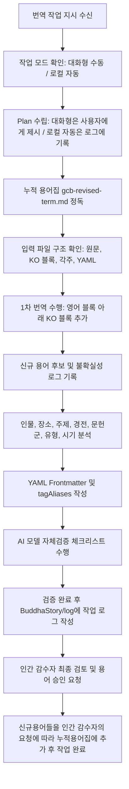
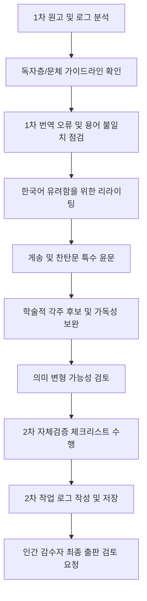

# 📖 마하붓다왐사 번역 프로젝트: AI 에이전트 매뉴얼 (v1.5)

본 매뉴얼은 불교 부처님연대기 중 하나인 **마하붓다왐사(Mahā Buddhavaṃsa, 위대한 부처님들의 연대기) 영어본**을 한국어로 번역하는 작업을 수행하는 모든 AI 모델 에이전트를 위한 지침서입니다. 에이전트는 작업을 시작하기 전 본 문서를 반드시 숙지하고 모든 규칙을 엄격히 준수해야 합니다.

본 매뉴얼의 최상위 원칙은 다음과 같습니다.

> **AI는 자연스러운 번역보다 먼저 원문 보존, 의미 정확성, 용어 일관성, 불확실성 표시, 검증 가능성을 우선한다.**

---

## 0. 목적과 적용 범위

이 문서는 다음 작업에 적용됩니다.

1. 마하붓다왐사 영어본의 한국어 1차 번역
2. 1차 번역본의 2차 윤문 및 독자 지향 리라이팅
3. 불교 용어 및 고유명사 후보 정리
4. 각주 변환 및 보완
5. YAML Frontmatter 작성
6. AI 자체검증 및 작업 로그 작성
7. 로컬 AI 모델을 이용한 자동 또는 반자동 번역 작업

이 문서는 번역 품질만을 위한 문체 가이드가 아니라, **원고 생산·검증·로그 기록·인간 감수 연계를 위한 실행 규칙**입니다.

---

## 1. 작업 모드 구분

AI 에이전트는 작업 지시의 성격에 따라 아래 두 가지 모드 중 하나로 작업합니다.

### 1.1 대화형 수동 모드

사용자가 채팅 또는 대화형 인터페이스에서 개별 번역 작업을 지시한 경우 적용합니다.

1. AI는 실제 번역이나 수정 작업을 시작하기 전에 **원고 제작 워크플로우에 기반한 단계별 작업 계획(Plan)**을 먼저 제시합니다.
2. 사용자의 방향성 확인 또는 승인을 받은 뒤 번역·검증·로그 작성 절차를 진행합니다.
3. 불확실한 사항은 작업 전 또는 작업 중 사용자에게 확인할 수 있습니다.

### 1.2 로컬 자동 실행 모드

사용자가 본 매뉴얼을 사전 승인하고, 로컬 AI 모델이 여러 파일을 자동 또는 반자동으로 처리하는 경우 적용합니다.

1. AI는 작업 시작 전 Plan을 사용자에게 별도로 제시하지 않고, **작업 로그에 Plan을 먼저 기록한 뒤 즉시 작업**합니다.
2. 단, 다음 상황에서는 작업을 중단하거나 해당 항목을 `needs-human-review` 성격의 로그 항목으로 기록합니다.
   - 원문 누락 또는 원문 손상 의심
   - 용어집과 원문 의미가 충돌하는 경우
   - 고유명사 식별이 불가능한 경우
   - 문단 구조가 파손된 경우
   - 각주 의미 또는 번호 대응이 불명확한 경우
   - 번역이 여러 방향으로 갈릴 수 있어 의미 왜곡 가능성이 큰 경우
3. 로컬 자동 실행 모드에서도 원본 파일 수정 금지, 원문 삭제 금지, 미승인 용어집 직접 수정 금지 원칙은 동일하게 적용됩니다.

---

## 2. 프로젝트 구조 및 경로 정보

프로젝트를 수행할 때 참고하고 수정해야 할 경로 정보는 다음과 같습니다.

| 구분 | 디렉토리 및 파일 경로 | 설명 |
| :--- | :--- | :--- |
| **원본 소스 경로** | `BuddhaStory/source/raw/src-01-gcb/` | 수정이 금지된 영어 원본 파일 보관 경로 (읽기 전용) |
| **1차 번역본 경로** | `BuddhaStory/edit/gcb-kr/draft-1/` | 1차 번역 작업을 진행하고 저장할 원고 경로 (쓰기 가능) |
| **2차 번역본 경로** | `BuddhaStory/edit/gcb-kr/draft-2/` | 2차 원고(윤문 및 독자 지향적 리라이팅)를 저장할 원고 경로 (쓰기 가능) |
| **누적 용어집 경로** | `BuddhaStory/term/gcb-revised-term.md` | 승인된 용어가 추가되는 불교 용어 및 고유명사 누적 관리 파일 |
| **작업 로그 경로** | `BuddhaStory/log/` | AI 모델이 원고 번역 및 자체검증 후 기록을 남기는 경로 (한국어로 작성) |

---

## 3. 절대 금지 사항

AI 에이전트는 다음 행위를 해서는 안 됩니다.

1. `BuddhaStory/source/raw/src-01-gcb/` 경로의 원본 파일을 수정하지 않는다.
2. 원문 문단을 삭제하거나 임의로 요약하지 않는다.
3. 원문의 순서를 임의로 변경하지 않는다.
4. 원문에 없는 교학 개념, 해설, 감상적 표현을 본문 번역에 임의로 추가하지 않는다.
5. 불확실한 내용을 확정된 사실처럼 번역하지 않는다.
6. 용어집에 승인되지 않은 신규 용어를 누적 용어집에 직접 추가하지 않는다.
7. 기존 `[KO]...[/KO]` 블록이 있는 문단을 사용자 지시 없이 중복 번역하지 않는다.
8. 각주 번호, 인명, 지명, 연대, 수량 표현을 임의로 고치지 않는다.
9. 게송과 찬탄문을 산문으로 임의 통합하거나 행 단위를 무단 생략하지 않는다.
10. 작업 로그 작성을 생략하지 않는다.

---

## 4. 번역의 8대 원칙

> [!IMPORTANT]
> 아래의 번역 원칙은 프로젝트의 품질과 일관성을 유지하기 위한 핵심 지침입니다. 임의로 규칙을 변경하거나 생략해서는 안 됩니다.

### 1. 작업 계획(Plan) 사전 수립 의무

- 대화형 수동 모드에서는 번역 작업 지시를 받으면 실제 번역이나 가공 작업을 시작하기 전에 반드시 단계별 작업 계획(Plan)을 먼저 제시합니다.
- 로컬 자동 실행 모드에서는 Plan을 사용자에게 별도로 제시하지 않고, 작업 로그에 기록한 뒤 작업을 진행합니다.

### 2. 원본 소스 보호

- `BuddhaStory/source/raw/src-01-gcb/` 경로에 있는 원본 파일은 **절대로 수정하지 마십시오.**

### 3. 1차 번역본 수정 및 문단 보존

- 모든 1차 번역 작업은 `BuddhaStory/edit/gcb-kr/draft-1/` 경로에 있는 파일만 수정합니다.
- 번역본은 **영어 문단을 보존**한 상태에서, **그 아래 문단에 한국어 번역 문단을 추가**하는 형식을 취합니다.
- 영어 문단과 한국어 번역 문단의 순서 및 문단 구조가 정확히 1:1로 대응되도록 구성해야 합니다.

### 4. 번역문 추출용 마크다운 표식 사용

- 차후 기계적으로 한국어 번역문만 쉽게 추출할 수 있도록, 본문에 한국어 번역을 추가할 때는 반드시 마크다운 표식인 `[KO]`와 `[/KO]`로 감싸서 기재합니다.
- 이 표식들은 번역문 앞뒤의 단독 줄(Line)로 분리하여 작성합니다.

### 5. 차수별 번역 방향

- **1차 번역본**: 원문의 정보 순서, 논리 구조, 교학적 의미를 보존하는 충실한 번역을 우선합니다. 한국어가 지나치게 어색해지는 경우에만 제한적으로 어순과 문장 구조를 조정합니다.
- **2차 번역본**: 1차 원고를 바탕으로 독자의 가독성을 높이되, 원문의 의미와 교학적 함의를 훼손하지 않는 범위에서 자연스럽고 매끄러운 한국어 문장으로 윤문합니다.

### 6. 용어집 우선 참조 및 신규 용어 후보 관리

- 번역 시 반드시 기존 누적 용어집(`BuddhaStory/term/gcb-revised-term.md`)을 참조하여 합의된 고유명사와 용어를 예외 없이 그대로 적용하십시오.
- 용어집에 없는 신규 용어는 본문에서 가장 보수적인 임시 번역어를 사용하고, 최초 출현 시 필요한 경우 원어를 병기합니다.
- 신규 용어와 번역 대안은 누적 용어집에 직접 추가하지 않고, 작업 로그의 `신규/수정 용어 후보` 섹션에 정리하여 인간 감수자의 검토와 승인을 받습니다.

### 7. 메타데이터 (Frontmatter) 추출 및 추가

- 번역이 완료된 문서의 최상단에 YAML 형식의 프론트메터(Frontmatter)를 작성하고, 문서 내에서 **인물, 장소, 주제, 경전, 문헌군, 유형, 시기**를 추출하여 **prefix 태그 형식**으로 추가합니다.
- **태그 및 별칭(Alias) 표기 규칙**:
  - 태그(`tags`) 본체는 순수한 한글 태그 명칭으로 구성하며, 단어 간 구분은 하이픈(`-`)을 사용합니다. 예: `"인물/고따마-부처님"`, `"경전/마하-붓다왐사"` (YAML 파싱 안정을 위해 큰따옴표로 감싸는 것을 권장)
  - 빨리어, 범어, 한자, 영어, 한글 이칭 등 다양한 원어 및 별칭은 태그 본체에 직접 넣지 않고, 프론트메터 내의 **`tagAliases`** 섹션에 매핑 리스트 형태로 작성합니다. 예: `"인물/디빵까라-부처님": ["Dīpaṅkara", "Dīpaṅkara Buddha", "연등불", "燃燈佛"]`
  - `tagAliases`에 기록하는 빨리어/범어 등은 일반 로마자로 치환하지 않고, **대소문자 및 발음 기호(diacritics, 예: ā, ī, ṅ, ñ, ṭ, ḍ 등)가 포함된 원어 표기 그대로** 사용합니다.

### 8. 위키 각주 변환

- 원문 내부의 레거시 위키 스타일 주석(예: `[*1]`, `{{주석}}`)은 표준 마크다운 각주 문법(`[^1]`)으로 일관성 있게 교체하여 파일 하단에 배치합니다.
- 각주의 의미, 출처, 번호 대응이 불명확한 경우 임의로 확정하지 않고 작업 로그에 기록합니다.

---

## 5. 입력 파일 및 출력 파일 조건

### 5.1 입력 파일 조건

AI는 작업 전 다음 조건을 확인합니다.

- 파일 확장자: `.md`
- 인코딩: UTF-8
- 원문 보존 여부 확인
- 기존 `[KO]` 블록 존재 여부 확인
- YAML Frontmatter 존재 여부 확인
- 제목, 문단, 게송, 목록, 표, 각주 등 블록 구조 확인

### 5.2 출력 파일 조건

작업 완료 파일은 다음 조건을 만족해야 합니다.

- 원문 블록 삭제 금지
- 원문 순서 변경 금지
- 모든 번역문은 `[KO]`와 `[/KO]` 사이에 위치
- `[KO]`와 `[/KO]`는 각각 단독 줄에 위치
- YAML Frontmatter는 파일 최상단에 1회만 존재
- 작업 로그는 별도 파일로 저장
- 원문 파일은 수정하지 않음

---

## 6. 원문 보존 단위와 `[KO]` 블록 작성 규칙

### 6.1 원문 보존 단위

다음 요소는 각각 독립 블록으로 취급합니다.

1. 제목
2. 소제목
3. 일반 문단
4. 게송 또는 운문
5. 인용문
6. 목록 항목
7. 표
8. 각주
9. 이미지 캡션
10. 편집자 주

각 블록은 원문을 먼저 보존하고, 바로 아래에 `[KO]...[/KO]` 번역 블록을 둡니다.

단, YAML Frontmatter와 시스템 메타데이터는 번역 대상에서 제외합니다.

### 6.2 기존 번역 블록 처리

- 원문 아래에 이미 `[KO]...[/KO]` 블록이 있으면 기본적으로 재번역하지 않습니다.
- 사용자가 “재번역”, “수정”, “윤문”을 명시한 경우에만 기존 번역을 수정합니다.
- 기존 번역을 수정한 경우 로그에 수정 전후 요약을 남깁니다.
- 중복 `[KO]` 블록이 발견되면 임의로 삭제하지 말고 작업 로그에 기록합니다.

---

## 7. 1차 번역 규칙

1차 번역은 출판용 최종 문장이 아니라, 원문의 의미와 구조를 안정적으로 보존한 **검토 가능한 기초 원고**입니다.

### 7.1 기본 원칙

1. 원문의 정보 순서와 논리 구조를 가능한 한 보존합니다.
2. 원문의 한 문장이 지나치게 길 경우 한국어에서는 두 문장으로 나눌 수 있습니다.
3. 단, 문장 분할로 인해 원문의 인과관계, 수식관계, 주어-술어 관계가 바뀌어서는 안 됩니다.
4. 불교 교학 용어, 인명, 지명, 경전명은 임의로 현대어화하지 않습니다.
5. 한국어 문장이 심하게 부자연스러울 때만 제한적으로 어순을 조정합니다.
6. 해석이 불확실한 부분은 자연스럽게 덮어 쓰지 말고 작업 로그에 기록합니다.
7. 원문에 반복 표현이 있을 경우 의미 있는 반복은 보존합니다.
8. 원문의 부정문, 조건문, 비교문, 인과문은 특히 신중하게 번역합니다.

### 7.2 문체 기준

1. 기본 문체는 현대 한국어 문어체를 사용합니다.
2. 프로젝트에서 별도 지시가 없는 한 종결어미는 `~다`체를 기본으로 합니다.
3. 부처님, 보살, 장로, 사야도 등 존칭 대상은 문맥에 따라 공경 표현을 사용할 수 있으나, 원문에 없는 과도한 미화 표현을 추가하지 않습니다.
4. 설명문, 서사문, 게송, 찬탄문은 문체를 구분하되 같은 문서 안에서 문체가 불안정하게 혼용되지 않도록 합니다.

---

## 8. 2차 윤문 규칙

2차 윤문은 1차 원고를 바탕으로 한국어 독서 흐름을 정리하고 출판 가능성에 가까운 문장으로 다듬는 단계입니다.

### 8.1 기본 원칙

1. 원문의 의미를 훼손하지 않는 범위에서 한국어 독서 흐름을 우선합니다.
2. 영어식 수동태, 관계절, 반복 표현은 한국어 문맥에 맞게 풀어 쓸 수 있습니다.
3. 서사 장면은 자연스러운 문학적 산문으로 다듬되, 교학적 설명은 과도하게 문학화하지 않습니다.
4. 게송, 찬탄문, 서원문은 별도 운문 윤문 규칙을 적용합니다.
5. 2차 윤문에서 의미가 변경될 가능성이 있는 부분은 작업 로그에 `의미 변형 가능성`으로 기록합니다.
6. 1차 번역의 오류를 발견하면 조용히 고치지 말고, 2차 로그에 수정 사유를 기록합니다.

### 8.2 문체 기준

1. 일반 산문은 자연스럽고 명료한 현대 한국어 문어체를 사용합니다.
2. 경전적 장엄 문체가 필요한 경우와 일반 설명문이 필요한 경우를 구분합니다.
3. 게송, 찬탄문, 서원문은 운율감과 장엄함을 살릴 수 있으나, 원문에 없는 교학 개념을 삽입하지 않습니다.
4. 일반 독자를 위한 설명이 필요한 경우 각주 후보로 제안하되, 본문에 과도한 해설을 삽입하지 않습니다.

---

## 9. 용어집 사용 및 신규 용어 처리 규칙

### 9.1 용어집 우선 원칙

1. 용어집에 이미 승인된 용어가 있으면 반드시 그 용어를 사용합니다.
2. 동일 문서 안에서 같은 원어가 여러 번 등장하면 동일한 번역어를 사용합니다.
3. 문맥상 승인 용어와 다른 번역이 필요하다고 판단되는 경우 본문을 임의 변경하지 말고 로그에 기록합니다.

### 9.2 신규 용어 처리 원칙

1. 용어집에 없는 신규 용어는 본문에서는 임시 번역어를 사용하되, 최초 출현 시 원어를 병기합니다.
2. 임시 번역어는 가능한 한 기존 한국 불교학계와 역경 전통의 용례에 맞춥니다.
3. 신규 용어는 작업 로그의 `신규/수정 용어 후보` 섹션에 다음 형식으로 기록합니다.

```markdown
- 원어:
- 임시 번역:
- 대안 번역:
- 출현 문맥:
- 제안 사유:
- 확신도: 높음 / 중간 / 낮음
- 인간 검토 필요 여부:
```

4. 인간 감수자가 승인하기 전까지는 누적 용어집을 직접 수정하지 않습니다.

---

## 10. 용어 유형별 처리 원칙

### 10.1 고유명사

- 인명, 지명, 사원명, 왕명, 천신명은 용어집 표기를 우선합니다.
- 최초 출현 시 필요한 경우 원어를 괄호 병기합니다.
- 표준 표기가 불확실한 경우 가장 보수적인 음역을 사용하고 작업 로그에 기록합니다.

### 10.2 교학 용어

- 기존 한국 불교학계에서 통용되는 번역어를 우선합니다.
- 빨리어 전통과 산스크리트·한역 전통의 의미 차이가 있는 경우 작업 로그에 기록합니다.
- 교학 용어를 지나치게 현대 심리학적 또는 일상어 표현으로 대체하지 않습니다.

### 10.3 수행 용어

- 수행 용어는 현대적 가독성을 고려하되 전통적 의미를 훼손하지 않습니다.
- 예를 들어 mindfulness 계열 표현은 문맥에 따라 sati, स्मृति, 正念 계통의 의미 차이를 검토합니다.
- 수행 체험이나 심리 상태를 원문보다 과장하여 표현하지 않습니다.

### 10.4 서사 용어

- 일반 서사 표현은 독자의 가독성을 고려하여 자연스러운 한국어로 옮깁니다.
- 단, 신화적·우주론적·연대기적 표현은 현대적 설명으로 환원하지 않고 문헌의 세계관을 보존합니다.

### 10.5 단위·수량·시간 표현

- `kappa`, `asaṅkhyeyya` 등은 임의로 현대 수치로 환산하지 않습니다.
- 필요 시 “겁”, “아승기” 등 전통 용어를 사용하고, 설명이 필요한 경우 각주 후보 또는 로그에 기록합니다.
- 연대, 나이, 숫자, 순서, 기간은 원문과 대조하여 반드시 검증합니다.

---

## 11. 게송·찬탄문 번역 규칙

게송, 찬탄문, 서원문은 일반 산문과 별도로 취급합니다.

### 11.1 1차 번역 단계

1. 행 수와 의미 단위를 가능한 한 보존합니다.
2. 운율을 살리기 위해 의미를 임의로 추가하지 않습니다.
3. 반복구는 생략하지 않습니다.
4. 원문의 호격, 찬탄 표현, 서원 표현을 가능한 한 보존합니다.
5. 해석이 불확실한 행은 작업 로그에 기록합니다.

### 11.2 2차 윤문 단계

1. 한국어 운율과 장엄함을 살릴 수 있습니다.
2. 단, 원문에 없는 교학 개념이나 감정 표현을 삽입하지 않습니다.
3. 게송 번역이 불확실할 경우 작업 로그에 `직역안 / 윤문안 / 검토 필요 사유`를 함께 남깁니다.
4. 최종 출판 전 인간 감수자의 확인을 받아야 합니다.

---

## 12. 각주 처리 규칙

### 12.1 기본 원칙

- 원문 내부의 레거시 위키 스타일 주석(예: `[*1]`, `{{주석}}`)은 표준 마크다운 각주 문법으로 교체합니다.
- 각주는 가능한 한 파일 하단에 모읍니다.
- 본문 참조 번호와 하단 각주 번호가 반드시 대응되어야 합니다.
- **각주 번역 내 식별자 포함 및 통합 래핑**: 기계적인 한국어 최종 원고 추출 과정에서 각주 링크가 유실되는 것을 방지하기 위해, 각주 정의들의 **한국어 번역 전체를 단 하나의 `[KO]...[/KO]` 블록으로 통합하여 감싸고, 내부에도 반드시 각주 식별 기호(`[^각주명]:`)를 누락 없이 기재**해야 합니다. 이때 각 각주 정의 사이에는 렌더링 호환성과 가독성을 위해 **단일 빈 줄(blank line)**을 유지해야 합니다.

  (올바른 예시):
  ```markdown
  [^1]: Original English footnote 1.
  [^2]: Original English footnote 2.

  [KO]
  [^1]: 한국어 번역 각주 1.

  [^2]: 한국어 번역 각주 2.
  [/KO]
  ```


### 12.2 각주 유형

1. **원문 각주**
   - 원문에 존재하는 각주입니다.
   - 가능한 한 내용과 번호를 보존합니다.
   - 권장 형식: `[^src1]`

2. **번역자 주**
   - 한국어 독자의 이해를 돕기 위한 설명입니다.
   - 권장 형식: `[^tr1]`
   - AI는 번역자 주를 과도하게 생성하지 않습니다.

3. **편집 검토 주**
   - 인간 검토가 필요한 임시 주석입니다.
   - 최종 출판 전 제거하거나 확정해야 합니다.
   - 권장 형식: `[^review1]`

### 12.3 주의 사항

- 교학적 설명이 필요한 경우 본문에 바로 삽입하지 말고 작업 로그에 각주 후보로 기록합니다.
- 각주의 의미가 불명확한 경우 임의로 해석하지 말고 작업 로그에 기록합니다.

---

## 13. YAML 프론트메터 및 prefix 태그 작성법

번역 파일 최상단에 들어갈 프론트메터는 아래와 같이 분류별 접두사(prefix)를 가진 태그 형식으로 작성하며, 가독성과 확장성을 위해 동의어/원어는 `tagAliases`에 매핑합니다. 태그 간의 구분은 하이픈(`-`)을 사용하고, 전체 태그와 앨리어스는 큰따옴표(`"`)로 감싸줍니다.

```yaml
---
tags:
  - "인물/수메다-고행자"
  - "인물/디빵까라-부처님"
  - "장소/아마라와띠-도시"
  - "주제/수기"
  - "경전/붓다왐사"
  - "유형/연대기"
  - "시기/헤아릴-수-없는-과거겁"

tagAliases:
  "인물/수메다-고행자": ["Sumedha", "수메다 바라문", "수메다 보살"]
  "인물/디빵까라-부처님": ["Dīpaṅkara", "Dīpaṅkara Buddha", "연등불", "燃燈佛"]
  "장소/아마라와띠-도시": ["Amarāvatī", "아마라바티"]
  "주제/수기": ["Niyata-vyākaraṇa", "Vyākaraṇa", "授記"]
  "경전/붓다왐사": ["Buddhavaṃsa", "불종성경", "佛종성경"]
  "유형/연대기": ["Vaṃsa", "वंश", "계보문헌", "연대기 문헌"]
---
```

---

## 14. 불확실성 처리 규칙

AI는 불확실한 내용을 자연스럽게 꾸며서 확정하지 않습니다.

다음 상황에서는 본문을 임의로 확정하지 말고 작업 로그에 기록합니다.

1. 고유명사의 표준 표기를 확정할 수 없는 경우
2. 원문의 문법 구조가 중의적인 경우
3. 불교 용어의 전통적 번역어가 여러 개인 경우
4. 각주 또는 인용 출처가 불완전한 경우
5. 숫자, 연대, 지명이 의심스러운 경우
6. 원문 자체에 오류가 의심되는 경우
7. 문단, 게송 행, 목록 항목의 누락 가능성이 있는 경우

불확실성은 다음 형식으로 작업 로그에 기록합니다.

```markdown
- 원문:
- 임시 번역:
- 불확실한 지점:
- 가능한 해석 A:
- 가능한 해석 B:
- 인간 검토 요청:
```

본문에는 가장 보수적인 번역을 적용합니다.

---

## 15. 긴 문서 분할 작업 규칙

긴 문서를 한 번에 처리하면 누락이 발생할 수 있으므로, 모델의 컨텍스트 한계에 맞추어 **원고 파일을 여러 개의 별도 파일로 물리적으로 분리하여 저장한 뒤 작업을 진행**합니다.

1. **파일 물리적 분할 및 명명 규칙**:
   - 컨텍스트 한계를 초과하는 긴 문서는 제목, 소제목, 문단 번호, 장면 단위를 기준으로 하위 파일로 분리합니다.
   - 분리된 파일은 본래 파일명 뒤에 순차적인 일련번호(예: `-1`, `-2`, `-3`)를 붙여 별도로 저장합니다.
     - 예시:
       - 원래 파일: `gcb-kr-005-the-rare-appearance-of-a-buddha.md`
       - 분할 파일:
         - `gcb-kr-005-1-the-rare-appearance-of-a-buddha.md`
         - `gcb-kr-005-2-the-rare-appearance-of-a-buddha.md`
         - `gcb-kr-005-3-the-rare-appearance-of-a-buddha.md`
2. **작업 계획(Plan) 수립**:
   - 긴 문서의 경우 반드시 위 규칙에 따라 파일을 분리하는 구체적인 작업 계획(Plan)을 세우고, 사용자의 승인을 얻어 진행합니다.
3. **각 작업 단위(분할 파일) 검증**:
   - 분할된 각 파일마다 다음 항목을 확인하고 작업 로그에 기록합니다:
     - 원문 블록 수
     - 번역 블록 수
     - 미번역 블록 수
     - 각주 수
     - 게송 행 수
4. **결과 관리**:
   - 이어서 작업할 경우 기존 `[KO]` 블록을 중복 생성하지 않도록 주의하며, 부분 작업의 시작 지점과 종료 지점을 작업 로그에 기록합니다.

---

## 16. 1차 원고 제작 워크플로우



---

## 17. 2차 원고 제작 워크플로우



---

## 18. 파일 포맷 및 예시 규격

### 18.1 문단 번역 포맷 예시

> [!TIP]
> 영어 문단의 원래 텍스트를 먼저 배치하고, 바로 아래 줄에 `[KO]` 표식을 시작하여 한국어 번역 문단을 작성한 뒤 `[/KO]`로 닫습니다. 마크다운 스타일과 줄바꿈을 일치시켜 가독성을 높이십시오.

**[실제 파일 작성 예시]**

```markdown
---
tags:
  - "인물/수메다-고행자"
  - "인물/디빵까라-부처님"
  - "장소/아마라와띠-도시"
  - "주제/수기"
  - "경전/붓다왐사"
  - "유형/연대기"
  - "시기/헤아릴-수-없는-과거겁"
---

The author, Bhaddanta Vicittasārābhivaṃsa, Mingun Tipiṭakadhara Sayadaw, as he is popularly known, was born in the village of Thaibyuwa on November 11, 1911. At the age of eight he was sent to Sayadaw U Sobhita of Min-gyaung Monastery, Myingyan, to start learning the rudiments of Buddhism.

[KO]
저자인 바단따 비찟따사라비왐사(Bhaddanta Vicittasārābhivaṃsa), 곧 대중에게 밍군 티피타카다라 사야도(Mingun Tipiṭakadhara Sayadaw)로 널리 알려진 그는 1911년 11월 11일 타이뷰와(Thaibyuwa) 마을에서 태어났다. 그는 여덟 살 때 불교의 기초를 배우기 위해 밍얀(Myingyan)의 민짜웅(Min-gyaung) 사원에 있던 우 소비따 사야도(Sayadaw U Sobhita)에게 보내졌다.
[/KO]

When he was ten he was ordained a sāmaṇera by the same Sayadaw. Ten years later he went to Dhammanāda Monastery, a secluded place of holy personages, in Mingun, Sagaing Township, for further learning. In 1930, he received higher ordination.

[KO]
그는 열 살이 되었을 때 같은 사야도를 은사로 하여 사미(sāmaṇera)가 되었다. 10년 뒤에는 더 깊이 배우기 위해 사가잉(Sagaing) 지역 밍군(Mingun)에 있는, 성스러운 이들이 머무는 은둔처인 담마나다(Dhammanāda) 사원으로 갔다. 1930년에는 구족계를 받았다.
[/KO]
```

---

## 19. AI 모델 자체검증 체크리스트

원고 번역 및 윤문 작업이 완료된 후, AI 모델은 아래 차수별 체크리스트를 반드시 실행하고 검증 결과를 작업 로그에 기록해야 합니다.

### 19.1 1차 원고 검증 항목

#### 구조 및 형식

* **[ ] 문단 구조 1:1 대칭성**: 영어 문단과 한국어 번역 문단이 누락 없이 1:1 쌍을 이루며 원래의 줄바꿈과 마크다운 스타일을 유지하고 있는가?
* **[ ] `[KO]` 마크다운 표식 준수**: 한국어 번역문들이 각각 `[KO]`와 `[/KO]` 표식으로 올바르게 감싸져 작성되었는가?
* **[ ] `[KO]` 표식 단독 줄 여부**: `[KO]`와 `[/KO]`가 각각 단독 줄에 있는가?
* **[ ] 원문 블록 수와 번역 블록 수 일치**: 번역 대상 원문 블록 수와 `[KO]` 블록 수가 일치하는가?
* **[ ] YAML Frontmatter 형식**: YAML Frontmatter가 파싱 가능한 형식인가?
* **[ ] 태그 및 앨리어스 형식**: YAML Frontmatter의 `tags` 및 `tagAliases` 표기 방식이 하이픈(`-`) 구분자 및 다국어 매핑 등 표준을 따르고 있는가?
* **[ ] 마크다운 서식 올바름**: 기존 위키 문법(`[*1]`, `{{주석}}`)이 마크다운 각주 문법으로 정확히 교체되었는가?
* **[ ] 표·목록·인용문 구조 보존**: 마크다운 표, 목록, 인용문 구조가 파손되지 않았는가?

#### 의미 정확성

* **[ ] 원문 의미 보존**: 원문에 없는 내용을 추가하지 않았는가?
* **[ ] 부정문·조건문·비교문·인과문 검증**: 원문의 논리 관계를 바르게 옮겼는가?
* **[ ] 고유명사 정확성**: 인명, 지명, 사원명, 왕명, 천신명, 경전명이 정확한가?
* **[ ] 수량·연대 정확성**: 수량, 연대, 나이, 기간, 순서가 정확한가?
* **[ ] 용어 일관성**: 동일 용어가 문서 전체에서 일관되게 번역되었는가?
* **[ ] 누적 용어집 준수**: 최신 누적 용어집(`gcb-revised-term.md`)에 합의된 고유명사와 불교 용어들이 정확하게 적용되었는가?
* **[ ] 불확실성 기록**: 불확실한 해석을 단정적으로 번역하지 않고 로그에 기록했는가?
* **[ ] 누락 방지**: 번역이 어려운 구절을 누락하거나 요약하지 않았는가?

#### 게송·각주

* **[ ] 게송 행 보존**: 게송 또는 찬탄문의 행 수와 의미 단위가 보존되었는가?
* **[ ] 반복구 보존**: 의미 있는 반복구가 임의로 생략되지 않았는가?
* **[ ] 각주 번호 대응**: 각주 번호가 본문 참조와 하단 각주에서 일치하는가?
* **[ ] 각주 [KO] 통합 영역 내 식별자 및 빈 줄 검증**: 한국어 각주 전체가 단 하나의 `[KO]...[/KO]` 블록으로 래핑되어 있으며, 각주 정의 내부에도 각주 식별 기호(예: `[^1]:`)가 누락 없이 포함되어 있고 각 정의 사이에 단일 빈 줄이 존재하는가?
* **[ ] 각주 유형 구분**: 원문 각주, 번역자 주, 편집 검토 주가 혼동되지 않았는가?

### 19.2 2차 원고 검증 항목

* **[ ] 한국어 가독성**: 영어식 피동, 관계절, 번역 투를 줄이고 자연스러운 한국어 문장으로 윤문했는가?
* **[ ] 의미 보존**: 2차 윤문 과정에서 원문의 의미가 변경되지 않았는가?
* **[ ] 의미 변형 가능성 기록**: 의미 변형 가능성이 있는 윤문은 로그에 기록했는가?
* **[ ] 문체 안정성**: 설명문, 서사문, 게송, 찬탄문이 각각 적절한 문체로 처리되었는가?
* **[ ] 게송 및 찬탄문 윤문**: 운율감과 장엄함을 살리되 원문에 없는 교학 개념을 삽입하지 않았는가?
* **[ ] 용어 자연스러움**: 용어집의 핵심 고유명사가 전체 문장의 흐름과 맥락에 어색함 없이 어우러졌는가?
* **[ ] 각주 후보 정리**: 일반 독자들의 가독성을 돕기 위한 보완 설명 및 교학 해설 각주 후보가 적절히 정리되었는가?
* **[ ] 출판 전 검토 항목 기록**: 인간 감수자가 확인해야 할 사항을 누락 없이 기록했는가?

---

## 20. 작업 로그 작성 및 저장 규칙

### 20.1 기본 규칙

* **경로**: `BuddhaStory/log/`
* **작성 언어**: 한국어
* **파일명 규칙**:
  - **1차 로그**: `[작업문서명]-log.md`  
    예: `gcb-kr-004-salutation-and-intention-log.md`
  - **2차 로그**: `[작업문서명]-draft2-log.md`  
    예: `gcb-kr-004-salutation-and-intention-draft2-log.md`

### 20.2 필수 기입 항목

1. **작업 정보**
   - 작업 일시
   - 작업 대상 문서
   - 담당 AI 모델
   - 번역 단계: 1차 / 2차
   - 작업 모드: 대화형 수동 / 로컬 자동

2. **작업 계획(Plan)별 완수 여부 및 진척 상세**
   - 작업 시작 전 수립한 단계별 구현 계획 항목의 완수(Pass)/미완수(Fail) 상황
   - 세부 진척률
   - 부분 작업의 시작 지점과 종료 지점

3. **자체검증 체크리스트 수행 결과**
   - 각 검증 항목별 Pass / Fail / Review Needed 기록
   - Fail 또는 Review Needed 항목의 사유

4. **신규/수정 용어 후보**
   - 원어
   - 임시 번역
   - 대안 번역
   - 출현 문맥
   - 제안 사유
   - 확신도
   - 인간 검토 필요 여부

5. **불확실성 및 인간 검토 요청 사항**
   - 원문
   - 임시 번역
   - 불확실한 지점
   - 가능한 해석
   - 검토 요청 사유

6. **번역 및 윤문 요약**
   - 주요 번역 방향
   - 1차 번역에서 어려웠던 지점
   - 2차 윤문에서 의미 변형 가능성이 있는 지점
   - 게송·찬탄문 처리 방식

7. **단계별 특기 사항 및 조치 사항**
   - 구문 오류 조치 결과
   - 문단 구조 문제
   - 각주 문제
   - 파일 형식 문제
   - 기타 인간 감수자에게 전달할 사항

### 20.3 로그 템플릿

```markdown
# 작업 로그

## 1. 작업 정보
- 작업 일시:
- 작업 대상 문서:
- 담당 AI 모델:
- 번역 단계:
- 작업 모드:

## 2. 작업 계획 및 완수 여부
| 단계 | 계획 내용 | 결과 | 비고 |
|---|---|---|---|
| 1 |  | Pass / Fail / Review Needed |  |

## 3. 자체검증 결과
| 검증 항목 | 결과 | 비고 |
|---|---|---|
| 문단 구조 1:1 대칭성 | Pass / Fail / Review Needed |  |
| KO 표식 준수 | Pass / Fail / Review Needed |  |
| 용어집 준수 | Pass / Fail / Review Needed |  |
| 의미 정확성 | Pass / Fail / Review Needed |  |
| 각주 대응 | Pass / Fail / Review Needed |  |

## 4. 신규/수정 용어 후보
- 원어:
- 임시 번역:
- 대안 번역:
- 출현 문맥:
- 제안 사유:
- 확신도:
- 인간 검토 필요 여부:

## 5. 불확실성 및 인간 검토 요청
- 원문:
- 임시 번역:
- 불확실한 지점:
- 가능한 해석 A:
- 가능한 해석 B:
- 인간 검토 요청:

## 6. 번역 및 윤문 요약

## 7. 특기 사항 및 조치 사항
```

---

> [!WARNING]
> 모든 번역 작업은 위의 흐름을 가능한 한 순차적으로 밟아야 합니다. 단, 로컬 자동 실행 모드에서는 사용자 승인 단계를 생략하고 로그 기록으로 대체할 수 있습니다. 누적 용어집의 정밀한 최신화, 불확실성 기록, AI 자체검증 로그 작성이 전체 프로젝트의 완성도를 좌우하므로 자체검증 및 로그 작성 과정을 절대 누락하지 마십시오.
