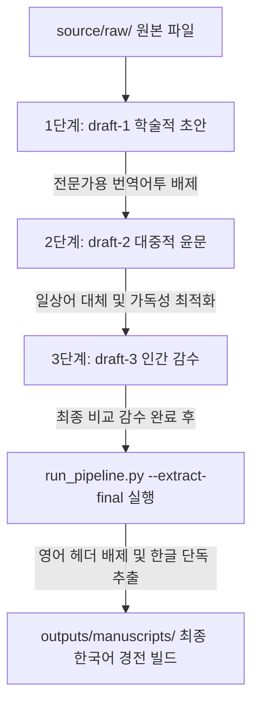

# 🌐 통합 불교 문헌 번역 프레임워크 (UBTF) 글로벌 공통 번역 매뉴얼
(Unified Buddhist Translation Framework - Global Core Translation Protocol)

본 매뉴얼은 UBTF(통합 불교 문헌 번역 프레임워크)에서 불교 문헌을 번역하는 모든 AI 에이전트와 감수자를 위한 핵심 지침서입니다. 본 매뉴얼의 목표는 원본 문헌의 보호, 마크업 무결성 유지, 그리고 3단계 번역 파이프라인의 표준화입니다.

---

## 1. UBTF 최상위 번역 규칙

AI 번역 에이전트는 자연스러운 번역보다 **의미적 정확성, 마크업 규격 준수, 각주 및 고유명사 보존, 불확실성 기록**을 절대 우선합니다.

### 1.1 절대 금지 사항
1. 원본 소스 디렉토리(`source/raw/`) 내의 파일을 직접 수정, 생성, 삭제하지 않는다.
2. 원문 문단을 삭제하거나 임의로 단락을 합치지 않는다.
3. 원문의 순서를 임의로 변경하지 않는다.
4. 원문에 없는 추가 교학 지식, 해석, 주관적 묘사를 본문 번역에 임의로 추가하지 않는다. (설명이 필요하면 각주 후보로 제안한다)
5. 용어집에 정식 등록되지 않은 신규 단어를 누적 용어집(`term/cumulative/`)에 임의로 추가하지 않는다.
6. 번역이 중복되거나 불확실한 지점을 감추지 않고 작업 로그에 솔직히 기록한다.

---

## 2. UBTF 3단계 번역 파이프라인

모든 UBTF 프로젝트는 다음과 같은 단계적 한국어화 라이프사이클을 가집니다.



### 2.1 [1단계] 학술적 초안 번역 (`draft-1`)
* **독자층**: 불교전문연구자 및 교학 전문가 그룹.
* **목표**: 원문의 교학적 선언과 세부 정보 논리를 손실 없이 완벽하게 복원하는 학술 번역.
* **가이드라인**: 자연스러운 한국어 문장을 쓰되, 전문 불교 용어(Pali/Sanskrit 음사 표기 및 한역 교학 용어)를 정형화하여 사용합니다.

### 2.2 [2단계] 대중적 윤문 번역 (`draft-2`)
* **독자층**: 고등학교 수준 이상의 평범한 대한민국 일반 대중.
* **목표**: 불교 전문 용어를 일상어로 풀어 서술하여 읽기 흐름을 부드럽게 다듬는 대중 친화적 윤문.
* **가이드라인**: 영어식 수동 구문과 학술적이고 딱딱한 어조를 제거하고, 이야기체 산문 흐름으로 문맥을 재구조화합니다.

### 2.3 [3단계] 최종 인간 감수 및 한국어 단독 원고 빌드 (`draft-3` $\rightarrow$ `outputs/`)
* **목표**: 감수자가 최종 조율한 `draft-3` 파일에서 영어 원문과 `[KO]` 마크업을 제거하고 최종 마크다운 결과물을 빌드합니다.
* **가이드라인**: 영어 헤더(h1~h5)는 생략하고, 한글 헤더와 본문 텍스트, 한국어 각주 정의만 추출하여 깨끗한 마크다운을 만듭니다.

---

## 3. 문단 정렬 및 `[KO]` 마크업 규격

### 3.1 문단 정렬 (1:1 Alignment)
* 본문은 영어 문단을 그대로 보존하고, 바로 아래 줄에 한국어 번역 문단을 1:1로 배치합니다.
* 제목(h1), 소제목(h2~h5), 일반 산문, 게송, 인용문, 표 등 모든 번역 블록에 1:1 규칙이 적용됩니다.

### 3.2 번역문 래핑 마커
* 한국어 번역 블록은 반드시 `[KO]`와 `[/KO]` 단독 행으로 감싸줍니다.

```markdown
Original English paragraph here.

[KO]
한국어 번역 문단은 여기에 위치합니다.
[/KO]
```

---

## 4. 각주(Footnote) 마킹 표준

### 4.1 본문 각주
* 본문 내부의 레거시 위키 스타일 주석(`[*1]`, `{{주석}}`)은 표준 마크다운 각주 기호(`[^1]`)로 변경해 배치합니다.

### 4.2 한국어 각주 통합 블록
* 최종 한국어 추출 시 링크 유실을 막기 위해, 파일 하단의 한국어 번역 각주들은 **단 하나의 `[KO]...[/KO]` 블록으로 통합하여 감싸야 합니다.**
* 통합 블록 내부에도 각주 식별자(`[^1]:`)를 명확히 작성해야 하며, 각 각주 정의 사이에는 **단일 빈 줄(blank line)**을 유지합니다.

```markdown
[^1]: Original English footnote 1.
[^2]: Original English footnote 2.

[KO]
[^1]: 한국어 번역 각주 1입니다.

[^2]: 한국어 번역 각주 2입니다.
[/KO]
```

---

## 5. YAML Frontmatter 및 접두사 태그 규격

모든 UBTF 번역 파일 최상단에는 아래 형식의 프론트메터가 포함됩니다.

```yaml
---
tags:
  - "인물/수메다-고행자"
  - "장소/라자가하-왕사성"
  - "주제/수기"
tagAliases:
  "인물/수메다-고행자": ["Sumedha", "수메다 보살"]
  "인물/디빵까라-부처님": ["Dīpaṅkara", "Dīpaṅkara Buddha", "연등불"]
---
```

### 5.1 태그 명칭 규칙
* 태그(`tags`) 본체는 순수한 한글 태그 명칭으로 구성하며, 단어 간 구분은 하이픈(`-`)을 사용합니다. 예: `"인물/고따마-부처님"`
* 로마자, 이칭, 원어 등은 프론트메터 내의 **`tagAliases`**에 매핑 리스트 형태로 작성합니다.
* `tagAliases` 내부의 원어 표기는 **대소문자 및 발음 기호(diacritics: ā, ī, ṅ, ñ, ṭ 등)를 손실 없이 원래 원어 표기 그대로** 사용합니다.

---

## 6. 빈 문서 예외처리 규칙 (Bypass Rule)
* 입력 파일 분석 중 본문 내용이 없고 단순 장(Chapter) 제목과 `## 본문` 헤더, 상호 참조 지시선만 포함된 경우 번역을 진행하지 않고 **우회(Bypass)** 처리합니다.
* 누락 오인을 막기 위해 자체 검증 스크립트 실행 시 자동으로 바이패스가 감지되어 작업 로그에 `"본문 내용이 없는 빈 문서이므로 번역 예외 처리함"` 사유를 포함한 예외 기록 로그가 자동 보관됩니다.

---

## 7. 번역 파이프라인 관리 도구 (`run_pipeline.py`) 사용 가이드

모든 UBTF 프로젝트는 `scripts/run_pipeline.py` 스크립트를 통해 Mechanical Linter 및 포맷 검증 단계를 거쳐야 합니다. 스크립트 실행 시 `--lang <코드>`와 `--project <프로젝트명>` 옵션을 주어 경로를 명확히 제어할 수 있습니다.

### 7.1 주요 명령 옵션

#### [1차 번역본 처리]
1. **각주 포맷 전처리**
   ```bash
   python3 scripts/run_pipeline.py --preprocess translation/en-kr/BuddhaStory/draft-1/[대상파일명].md
   ```
2. **1차 원고 검증 및 자가검증 로그 자동 생성**
   ```bash
   python3 scripts/run_pipeline.py --validate translation/en-kr/BuddhaStory/draft-1/[대상파일명].md
   ```

#### [2차 윤문 처리]
3. **2차 윤문 환경 초기화 & 용어 템플릿 생성**
   ```bash
   python3 scripts/run_pipeline.py --init-draft2 translation/en-kr/BuddhaStory/draft-1/[대상파일명].md
   ```
4. **2차 원고 정합성 검사, 로그 자동 생성 및 draft-3 복사**
   ```bash
   python3 scripts/run_pipeline.py --validate-draft2 translation/en-kr/BuddhaStory/draft-2/[대상파일명].md
   ```
5. **로그 피드백 분석을 통한 워크플로우 자가 진화**
   ```bash
   python3 scripts/run_pipeline.py --upgrade-workflow log/en-kr/BuddhaStory/draft-2/[대상파일명]-draft2-log.md
   ```

#### [3차 최종 감수본 처리]
6. **최종 한국어 원고 단독 추출**
   ```bash
   python3 scripts/run_pipeline.py --extract-final translation/en-kr/BuddhaStory/draft-3/[대상파일명].md
   ```

---

## 8. 워크플로우 자가 개정 이력 (Self-Upgrade History)

에이전트는 작업 과정에서 발견한 규칙의 예외나 파싱 오류 보완 요청사항을 2차 검증 로그의 `## 8` 섹션에 `[룰문서]` 태그와 함께 기재합니다. `--upgrade-workflow` 구동 시 아래 리스트에 자동으로 개정 이력이 패치되어 진화해 나갑니다.

- **[2026-06-12]** (from `gcb-1.1.2.1-Singular Opportunity of Living in an Age when a Buddha-draft2-log.md`):
  - 2차 윤문 검증 시 다구(Pali) 단어 뒤 괄호 병기 생략 예외 추가

- **[2026-06-12]** (from `gcb-1.1.2.2-Bodhisatta (a future Buddha)-draft2-log.md`):
  - 2차 윤문 환경 세팅 시 1차에서 추출된 신규 용어집에 반드시 2차 번역어(2차 :)를 작성한 후 번역에 반영할 것

- **[2026-06-12]** (from `gcb-1.1.1.0-Salutation & Intention-draft2-log.md`):
  - 2차 윤문 시 교학설명 외의 서사 문맥에서 Dhamma는 '법' 외에 '가르침' 또는 '가르침(Dhamma)'으로 유연하게 번역할 수 있음

- **[2026-06-12]** (from `gcb-1.1.2.1-Singular Opportunity of Living in an Age when a Buddha-draft2-log.md`):
  - 2차 윤문 검증 시 복합어(예: brother-in-law) 혹은 인명의 일부(예: Pakudha Kaccāyana)가 단독 단어 용어집 검사에서 오탐지로 경고를 발생시킬 경우 예외로 허용함

- **[2026-06-13]** (from `gcb-1.1.2.1-Singular Opportunity of Living in an Age when a Buddha-draft2-log.md`):
  - 2차 윤문 검증 시 복합어(예: brother-in-law) 혹은 인명의 일부(예: Pakudha Kaccāyana)가 단독 단어 용어집 검사에서 오탐지로 경고를 발생시킬 경우 예외로 허용함
