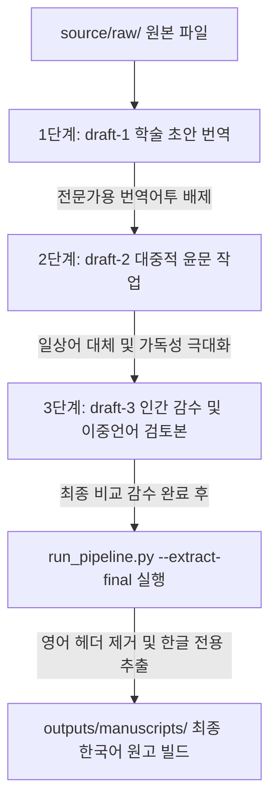

# 🔄 통합 불교 문헌 번역 프레임워크 (UBTF) 워크플로우 명세서
(Unified Buddhist Translation Framework - Workflow Specification)

본 문서는 UBTF(통합 불교 문헌 번역 프레임워크) 상에서 불교 번역 원고가 생성, 윤문, 감수되어 최종 마크다운 파일로 빌드되는 3단계 번역 가이드라인을 상세히 기술합니다.

---

## 1. 3단계 번역 파이프라인 (Three-Stage Translation Pipeline)

### 1.1 [1단계] 학술적 초안 번역 (`draft-1`)
*   **독자층**: **불교전문연구자 및 교학 전문가 그룹**
*   **지향점**: 원문의 불교 교학적 의미와 세부 정보 논리 구조를 안정적으로 보존하는 **학술적이고 엄밀한 번역**
*   **가이드라인**:
    1. 원어의 번역어투(직역투)에서 탈피하여, 자연스러운 한국어 문장 형태와 정합성을 부여하여 번역합니다.
    2. 불교 전문용어(Pali/Sanskrit 전사어 및 한역 교학 용어)를 적극 활용하여 교리적 구분을 명확히 합니다.
    3. 원문의 모든 헤더(h1~h5: `#`, `##`, `###` 등)를 번역하며 타이틀 헤더는 프로젝트 목차 대조 파일(예: `gcb-kr-TOC.md`)을 준수하여 `[KO]...[/KO]` 내에 번역합니다.

### 1.2 [2단계] 대중적 윤문 번역 (`draft-2`)
*   **독자층**: **고등학교 수준 이상의 평범한 대한민국 일반 대중**
*   **지향점**: 불교전문용어를 최소화하고 일상어로 최대한 대체하여 읽기 쉬운 **대중 친화적 번역**
*   **가이드라인**:
    1. 학술적 엄밀함보다 **일반 독자의 가독성 및 직관적 이해성**에 온전한 초점을 맞춥니다.
    2. 1차 번역의 어려운 불교 전문 용어를 최대한 배제하고, 쉬운 일상어로 대체하거나 풀어 서술합니다.
    3. 영어식 피동 구문이나 딱딱한 학술투 어조를 완전히 제거하고 자연스러운 산문 문학 흐름으로 문맥을 전면 리라이팅합니다.
    4. 소제목과 중간 헤더들도 대중이 가독성 높게 받아들일 수 있도록 유려하게 한국어화합니다.

### 1.3 [3단계] 최종 인간 감수 및 한글 추출 (`draft-3` -> `outputs/`)
*   **지향점**: 인간 감수자가 1차(학술)본과 2차(가독)본을 최종 조율/융합하여 3차 본을 확정한 뒤, 최종 출판물을 빌드합니다.
*   **가이드라인**:
    1. 감수자가 3차 원고에서 영어 원문 문단과 `[KO]`, `[/KO]` 마커를 완전히 제거하고 한국어 텍스트 및 한글 각주만 수집하는 자동화 파이프라인 빌드를 구동합니다.
    2. 최종 빌드 시 영어 헤더(h1~h5)는 걸러내고 번역된 한글 헤더들만 보존하여 단일 한국어 마크다운 파일을 생성합니다.

---

## 2. 문헌 언어군별 특수 워크플로우 확장 지침

### 2.1 빨리어(Pali) 및 범어(Sanskrit) 번역
*   **1차 학술 번역**: 로마자 전사(Romanized)본의 격변화(Declension), 성, 수, 복합어 구성을 엄밀히 해석합니다. 발음 기호(Diacritics: `ā, ī, ṅ, ñ, ṭ` 등)를 손실 없이 원형 그대로 유지하여 학술적 추적성을 보장합니다.
*   **2차 대중 윤문**: 난해한 음사 표기를 통용 불교 한자어로 바꾸거나 한글 독음 표기를 보편화하여 일반 독자의 읽기 흐름을 부드럽게 합니다.

### 2.2 한역 경론(Classical Chinese) 번역
*   **1차 학술 번역**: 한문 고유의 대칭 구조 및 생략 성분을 교학적으로 메워 번역하되, 한역된 불교 용어를 학술적으로 정밀하게 음독 표기합니다.
*   **2차 대중 윤문**: 한문 조사가 사용된 복잡한 구조와 한자 결합 구를 한국어 서사 표현으로 길게 풀어 써 대중적 이해도를 극대화합니다.
